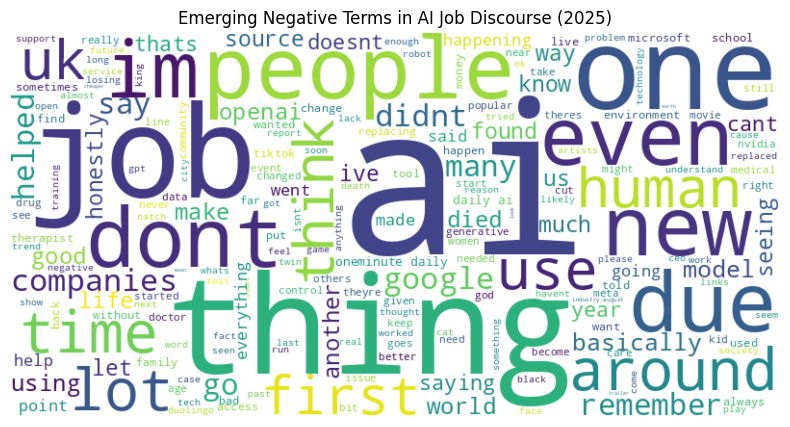

# Reddit AI Job Sentiment Tracker (2025)

  
*A visualization of emerging negative terms in AI job discourse*

---

## ▸ Project Overview
Artificial Intelligence is reshaping the job market with sparking **optimism, skepticism, and fear** across online communities.  
This project dives into **Reddit discussions** to uncover public sentiment around AI and employment in 2025.

Using **NLP + Visualization**, I track sentiment trends across subreddits, surface emerging themes, and visualize how people really feel about AI’s impact on jobs.

---

## ▸ The Challenge
The [World Economic Forum](https://www.weforum.org/publications/the-future-of-jobs-report-2025/digest/) forecasts that **slower growth could displace 1.6 million jobs globally by 2030**. At the same time, although no study explicitly quantifies public relations (PR) damages in the AI sentiment arena, analogous cases, such as sudden viral backlash or failure to respond to public concerns, are widely understood in marketing and communications to risk costs in the **hundreds of thousands of dollars**.  

Together, these trends highlight the need for **real-time insights into how AI is perceived in the workforce**, so organizations can adapt early and avoid reputational or financial fallout.

---

## ▸ The Solution

I built this tracker to turn raw Reddit data into actionable intelligence. Here’s how it works:  

✦ Fetches over 2,000 real-time posts from "artificial" and "future" subreddits.  
✦ Filters for AI job topics like "automation" and "2025" using natural language processing.  
✦ Analyzes sentiment with VADER, ranging from -1 to 1, to gauge public mood.  
✦ Visualizes trends with Plotly charts and word clouds, highlighting key concerns.  
✦ Predicts viral potential with a Gradient Boosted Tree model.  


---

## ▸ Getting Started
Ready to explore? Follow these steps to run the project:
- Clone the repository: `git clone https://github.com/godhanaravara/reddit-trend-sentiment.git`
- Install dependencies: `pip install -r requirements.txt`
- Create a `.env` file with your Reddit API credentials:

```python
CLIENT_ID=your_client_id_here  
CLIENT_SECRET=your_client_secret_here  
USER_AGENT=SentimentTracker_v0.1_by_u_godhanaravara  
```

- Add `.env` to `.gitignore` to keep it secure.
- Open `RedditSentiment.ipynb` in Databricks or a local Jupyter environment.

---

## ▸ Key Insights
- Filtered 85 posts from 1,489, with sentiment scores ranging from -0.7405 to 0.9626, indicating a mix of perspectives, with a notable high of 0.9626 observed on August 27, 2025.
- Word clouds highlight negative terms such as "layoff," "automation," and "displacement," reflecting key concerns in AI job discourse.
- Daily sentiment trends exhibit fluctuations, providing a dynamic view of evolving opinions and enabling timely business responses.

Check out the visualizations in `RedditSentiment.ipynb`!

---

## ▸ Tech Stack
This project leverages:

-  + : For scalable data processing, serving as the primary development and execution environment.
- : For advanced data transformation and DataFrame operations.
- : To pull real-time Reddit data.
- : For natural language processing to clean, filter, and analyze text data.
-  + : Supporting tools for NLP, used for text cleaning and sentiment analysis.
-  + : For dynamic and static visualizations.
- : For predicting viral post potential.
- : The core language for coding and integration.
-  (Regular Expressions): For text processing.
-  + : For version control and project hosting.
- : For secure environment variable management.
- : The interactive development interface for writing, testing, and documenting the project.

---

## ▸ About Me
I am a data enthusiast passionate about using AI to understand human trends. This project reflects my journey in blending technology with real-world impact. Connect with me on [LinkedIn](https://www.linkedin.com/in/yourprofile) or explore more at my [GitHub](https://github.com/godhanaravara)!


